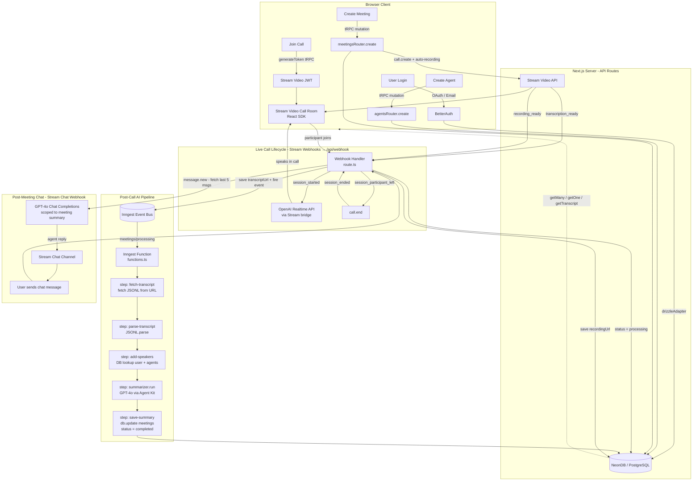

# Meet-AI: Codebase Architecture Overview

## 1. What This Application Does

**Meet-AI** is an AI-powered meeting platform. It allows users to:

- **Create AI Agents** — configure custom AI personas with specific system instructions (e.g., a medical advisor, a sales coach, etc.).
- **Schedule & Run Meetings** — start a video call with a real-time AI agent joining as a participant, powered by OpenAI's Realtime API.
- **Auto-Transcribe & Record** — Stream.io automatically transcribes and records every call in 1080p.
- **AI Summarization** — after the call ends, an Inngest background job fetches the transcript and uses GPT-4o to generate a structured Markdown summary (Overview + timestamped Notes).
- **Post-Meeting Chat** — users can chat with the agent over Stream Chat after the meeting is complete. The agent answers questions scoped to the meeting transcript and summary.

---

## 2. Core Tech Stack & Frameworks

| Layer | Technology |
|---|---|
| **Framework** | Next.js 15 (App Router, React 19, Server Components) |
| **Language** | TypeScript 5 |
| **Database** | PostgreSQL via Neon (serverless), Drizzle ORM |
| **Auth** | BetterAuth (Google OAuth, GitHub OAuth, Email+Password) |
| **API Layer** | tRPC v11 + TanStack Query v5 |
| **Video Calls** | Stream Video React SDK + Stream Node SDK |
| **Chat** | Stream Chat React SDK + Stream Node SDK |
| **AI – Realtime** | OpenAI Realtime API (connected via Stream's bridge) |
| **AI – Summarization** | Inngest Agent Kit (`@inngest/agent-kit`) + GPT-4o |
| **AI – Post-Meeting Chat** | OpenAI Chat Completions (GPT-4o) |
| **Background Jobs** | Inngest (event-driven, serverless functions) |
| **UI Components** | shadcn/ui (Radix UI primitives + Tailwind CSS v4) |
| **Schema Validation** | Zod v4 |
| **Styling** | Tailwind CSS v4 |
| **Avatar Generation** | DiceBear (`initials`, `botttsNeutral` variants) |

---

## 3. Architectural Patterns

### 3.1 Next.js App Router with Route Groups
The `src/app` directory uses route groups for clean separation:
- `(auth)/` — public sign-in/sign-up pages
- `(dashboard)/` — protected dashboard and meeting management
- `call/[meetingId]/` — full-screen in-call experience
- `api/` — backend route handlers (tRPC, Inngest, Auth, Webhook)

### 3.2 Feature-Sliced Module Architecture
Each business domain lives in `src/modules/<feature>/` with predictable sub-structure:

```
src/modules/<feature>/
  ├── server/procedures.ts   # tRPC router with all DB queries
  ├── ui/                    # React components & views
  ├── hooks/                 # Client-side TanStack Query hooks
  ├── schemas.ts             # Zod validation schemas
  ├── types.ts               # TypeScript types
  └── params.ts              # URL search param definitions (nuqs)
```

### 3.3 tRPC as the Type-Safe API Layer
All client-server communication flows through tRPC v11. The router is mounted at `/api/trpc`. `protectedProcedure` is a reusable middleware that validates the BetterAuth session on every call before executing any handler.

### 3.4 Event-Driven Background Processing (Inngest)
Post-call AI processing is fully asynchronous. The webhook fires an Inngest event (`meetings/processing`) and returns immediately. The Inngest function handles the heavy lifting in isolated `step.run()` blocks (fetch → parse → DB lookup → GPT-4o → save), which are retryable and observable.

### 3.5 Webhook-as-Orchestrator Pattern
The single `/api/webhook` route is the operational brain of the live meeting lifecycle. Stream.io pushes signed webhook events, and this handler orchestrates: agent injection, status transitions, recording storage, transcript handoff to Inngest, and post-meeting chat responses.

---

## 4. Database Schema

```
user ──────┐
           ├── session (FK: userId)
           ├── account (FK: userId)
           ├── agents  (FK: userId) ─────┐
           └── meetings (FK: userId)     │
                        (FK: agentId) ───┘
```

**`meetings`** has a lifecycle status enum: `upcoming → active → processing → completed` (or `cancelled`).

---

## 5. Data Flow: Webhook Input → Inngest AI Output

The core of the application is the event-driven pipeline from a live call event (`call.transcription_ready`) to a stored AI summary. Here's the step-by-step flow:

### Step 1 — User joins the call (Frontend → Stream)
The client calls `meetings.generateToken` (tRPC mutation) to get a Stream Video JWT, then connects to the Stream call room using the `@stream-io/video-react-sdk`.

### Step 2 — Session starts (Stream → Webhook)
Stream posts `call.session_started` to `/api/webhook`. The handler:
1. Verifies the HMAC signature (`x-signature` header)
2. Sets `meeting.status = "active"` in the DB
3. Connects to the Stream call via `streamVideo.video.connectOpenAi(...)` — this bridges OpenAI's Realtime API into the call as the AI agent participant
4. Applies the agent's custom `instructions` to the realtime session

### Step 3 — Call ends (User leaves → Stream → Webhook)
When the last human participant leaves, `call.session_participant_left` fires → the handler calls `call.end()`. Stream then fires `call.session_ended` → status set to `"processing"`.

### Step 4 — Transcript ready (Stream → Webhook → Inngest)
Stream fires `call.transcription_ready` with a JSONL file URL. The webhook handler:
1. Saves `transcriptUrl` to the DB
2. Sends an Inngest event: `{ name: "meetings/processing", data: { meetingId, transcriptUrl } }`

### Step 5 — AI Summarization Pipeline (Inngest function)
`meetingsProcessing` in `src/inngest/functions.ts` runs as isolated, retryable steps:

| Step | Action |
|---|---|
| `fetch-transcript` | `fetch(transcriptUrl)` → raw JSONL text |
| `parse-transcript` | `JSONL.parse<StreamTranscriptItem>()` → structured objects |
| `add-speakers` | DB lookup of `user` and `agents` tables by `speaker_id`; resolves names |
| `summarizer.run()` | Inngest Agent Kit sends enriched transcript to GPT-4o with a structured prompt |
| `save-summary` | `db.update(meetings).set({ summary, status: "completed" })` |

### Step 6 — Recording saved (Stream → Webhook)
`call.recording_ready` fires with the MP4 URL → saved to `meetings.recordingUrl`.

### Step 7 — Post-meeting chat (Stream Chat → Webhook)
`message.new` events on the completed meeting channel trigger GPT-4o chat completions, scoped to the meeting summary and agent instructions, and reply back via `streamChat.channel.sendMessage()`.

---

## 6. Request Flow — Mermaid Flowchart


